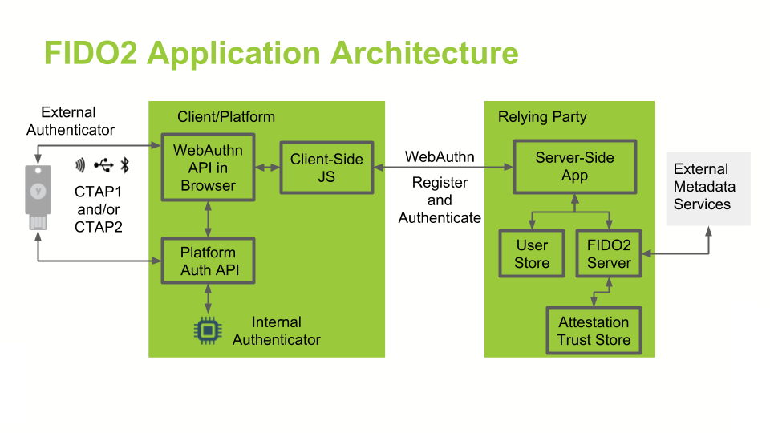

# Mein neues Tooling – dazwischen spielen wir Golf

- Persönlicher Erfahrungsbericht, nach 3 Monaten!
- Mehr Tastatur, weniger Maus
- Sicherheit
- Reproduzierbarkeit und Dokumentation
- Gerne eure Erfahrungen und Tipps im Nachgang

---

## Golf Testing

### «ci"», «daw» & Co.: Textobjekte rocken

---

### «ci"», «daw» & Co.: Textobjekte rocken

1. Cursor im "hello world" → ci"Hi Vim<Esc>
2. Cursor in (w + h) → da) (löscht die ganze Klammer); danach ggf. daw, um das übriggebliebene "+ " zu entfernen
3. Cursor in 'app' → ct' /var/www <Esc>

```
- `c`, `d`, `v`, `y`
- `a`, `i`
- `t`, `w` oder explizit `{`, `"`
```

---

## Tastatur

### Pro

- [https://bastardkb.com](https://bastardkb.com) – komplett Open-Source
- Mehr Möglichkeiten mit dem Daumen
- Weniger Bewegung, alles erreichbar
- Klein und handlich
- Konfigurierbar und überall einsetzbar
- VIA (Demo) – der Weg ist das Ziel

---

## Tastatur

### Contra

- Daumentasten
- USB-Buchse
- Controller
- Laptop unterwegs

---

## Golf

### Bewegungen + Operatoren kombinieren

---

### Bewegungen + Operatoren kombinieren

```text
Idee: Mit Operatoren + Motion arbeiten, z. B. auf Zeilen mit "# Aufgabe" springen und "cW" → "##", oder "I#" etc.
```

- `ct(`
- `d2w`
- `c$`
- `y}`

---

## FIDO2

- [https://www.token2.swiss/](https://www.token2.swiss/)
- Backup
- Diverse Einsätze (passwortlos, zweiter Faktor, SSH)
- Key bleibt auf Gerät, kein Phishing (Domain, Keys und TLS)
- Datenschutz (Daten auf Gerät; biometrisch)
- LUKS, OS, SSH und diverse Online-Konten
- Contra: RFID



---

## Golf

### Visueller Blockmodus zum Spalten-Editieren

---

### Visueller Blockmodus zum Spalten-Editieren

```text
Lösungsidee: gg, Ctrl-v, mit j runter, I, "// TODO: " tippen, <Esc>
```

- `gg`, `Shift+G`
- `Ctrl+V`, `j`, `j`
- `I`, `*`, `Esc`
- `A`, `i`, `a`

---

## NixOS

### Pros

- Deklarativ
- Reproduzierbar (echte Encryption)
- Atomare Updates & Rollbacks
- Isolierte Builds
- Mehrere Versionen parallel
- Cross-Platform

---

## NixOS

### Contra

- Lernkurve
- Ökosystem
- Packaging-Edge-Cases
- Read-Only

---

## Demo

```bash
reboot        # (Rollback / Token2)?
which openssl
nix-shell -p openssl
nix develop   # (flake.nix, shell.nix)
# configuration.nix (waybar, user)
```

---

## Golf

### Suchen & Ersetzen mit «%s» und «\v»

---

### Suchen & Ersetzen mit «%s» und «\v»

```vim
:%s/user_id/userId/g
:%s/is_active/isActive/g
```

- `%s/search/replace/g`
- `%s/search/replace/gc`
- Mark, `%s//replace/g`
- `%s/\vtest()/hallo()/g`

---

## Vim

- LazyVim (Terminal, File Search, Grep, File-Manipulationen, LazyExtras)
- kitty, ZSH (einfach `Esc`, IP-Adresse und `ping` – Scrollback)
- Browser
- Hyprland (ein andermal)

---

## Golf

### Makros aufnehmen und abspielen

---

### Makros aufnehmen und abspielen

```text
Lösungsidee: Cursor auf "apple"
qa  (Macro a starten)
A, fruit<Esc>j
q   (stop)
2@a (zweimal abspielen)
```

- `qa` – Makro in `a` speichern
- `A`, `, text`, `Esc`, `j` (`q` – Recording beenden)
- `2@a` – zweimal Makro `a` abspielen
- `.`
- Register: `"_dw`, `"0p`
- Springen: `ma`, `'a`
- Undo/Redo: `u`, `Ctrl+R`

---

## Danke (Esc → viw → Shift+U)

- Buchtipp: _Practical Vim: Edit Text at the Speed of Thought_
  978-1680501278

<!--
https://marpit.marp.app
marp slides.md -w --theme-set custom-theme.css
-->
